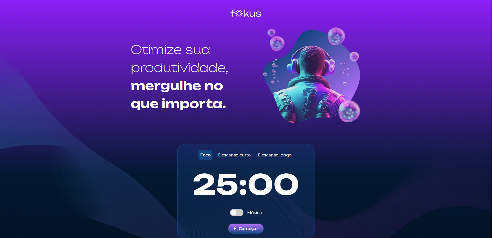

# Fokus

  

## 📍 Link do Projeto
https://fokus-beta.vercel.app/

## 📑 Descrição

 O Fokus é uma aplicação de temporizador estilo Pomodoro 

  Utilizando Javascript puro para manipular o dom e manipula e armazene dados, para criar um crud que automatiza tarefas.

## ✔️ Técnicas e tecnologias utilizadas

HTML

CSS

JAVASCRIPT 

## 🛠️ Abrir e rodar o projeto
Com a extensão do VSCODE live server para abrir a aplicação na porta selecionada

